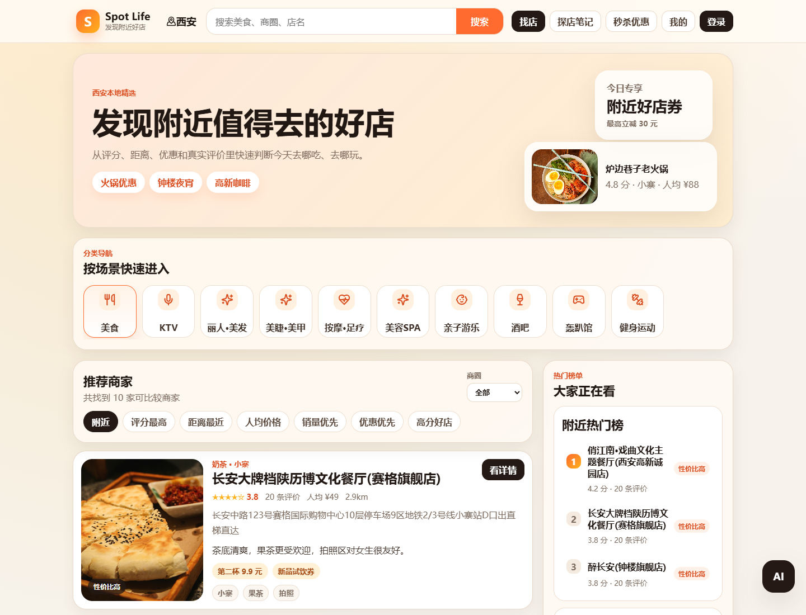
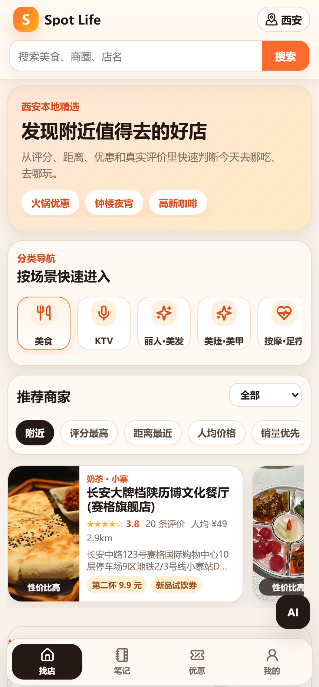
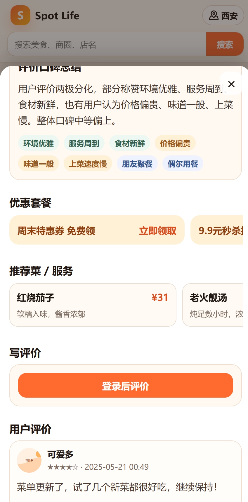
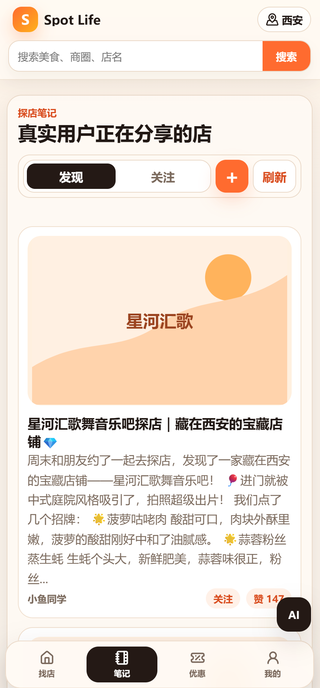
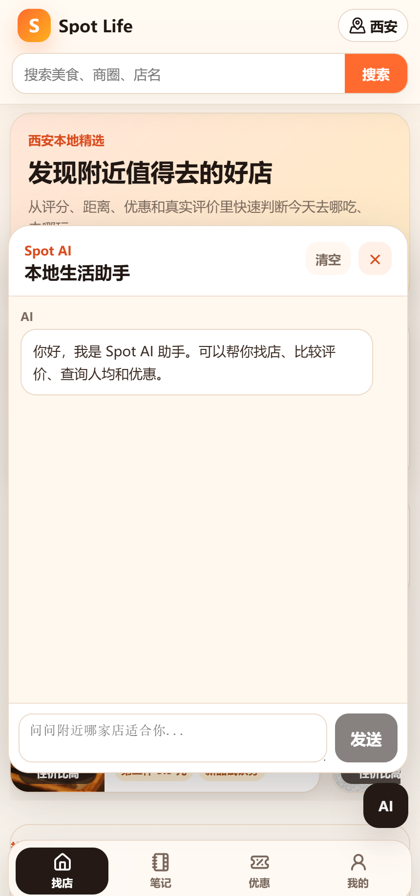

# Spot AI

Spot AI 是一个面向西安本地生活场景的点评平台示例项目，覆盖“找店、看评价、领优惠、写笔记、AI 辅助决策”的完整用户路径。项目包含 React 移动优先前端、Spring Boot 后端、MySQL/Redis/MinIO 基础设施，以及基于 Spring AI / Spring AI Alibaba 的店铺推荐、评价总结和偏好记忆能力。

## 项目地址
http://47.94.167.208/

## 项目预览

| 首页 | 移动端首页 |
| --- | --- |
|  |  |

| 店铺详情 | 探店笔记 | AI 助手 |
| --- | --- | --- |
|  |  |  |

## 核心功能

- **本地生活首页**：城市定位、搜索、分类导航、推荐商家、筛选排序、热门榜单。
- **店铺详情**：店铺头图、评分、人均、地址、营业时间、优惠券、秒杀券、菜品/服务、用户评价、下滑加载。
- **探店笔记**：发现/关注切换、发布笔记、图片上传、点赞、关注博主、查看详情。
- **用户体系**：邮箱验证码登录、用户资料、签到、我的笔记、我的评价、删除内容。
- **优惠券业务**：普通代金券领取、秒杀券下单、库存校验、订单记录。
- **AI 助手**：自然语言找店推荐、店铺详情问答、优惠券确认卡片、Markdown 回复渲染、对话历史展示。
- **评论 RAG 总结**：评价变更后标记刷新，后台生成店铺摘要，MySQL + Redis 缓存，前端和 AI 读取摘要。
- **AI 记忆**：记录用户偏好和部分对话历史，推荐店铺时参考长期偏好。
- **文件上传**：评价/笔记图片上传到 MinIO，并返回可访问 URL。

## 技术栈

### 前端

- React 18
- Vite 5
- lucide-react
- marked
- 原生 CSS 响应式布局

### 后端

- Java 17
- Spring Boot 3.4
- Spring AI 1.0
- Spring AI Alibaba DashScope
- MyBatis-Plus / JDBC
- RocketMQ Spring Boot Starter
- Redisson / Spring Data Redis
- MinIO Java SDK

### 基础设施

- MySQL 8
- Redis Stack
- MinIO
- RocketMQ（可选）
- Docker Compose

## 架构概览

```text
web/ React + Vite
  │
  │ HTTP / JSON
  ▼
spotai/ Spring Boot API
  ├─ 用户、店铺、评价、笔记、优惠券
  ├─ AI ChatClient + Tool Calling
  ├─ 评论摘要 RAG 任务
  ├─ MinIO 文件上传
  └─ Redis 缓存 / 分布式能力
      │
      ├─ MySQL：业务数据、AI 记忆、评论摘要
      ├─ Redis Stack：缓存、向量检索、活动状态
      └─ MinIO：图片对象存储
```

AI 模块采用 DeepSeek 作为对话模型，DashScope 作为向量化模型。后端通过 Tool Calling 暴露店铺搜索、推荐、详情、评价总结、优惠券查询和确认领取等能力，让模型先查真实业务数据，再组织回答。

## 目录结构

```text
.
├── web/                         # React 前端
│   ├── src/main.jsx             # 首页、详情、笔记、优惠、我的、AI 助手
│   ├── src/styles.css           # 移动优先样式
│   └── src/*.js                 # 前端数据归一化与测试工具
├── spotai/                      # Spring Boot 后端
│   ├── src/main/java/...        # Controller / Service / Repository / DTO
│   ├── src/main/resources/      # application.yml
│   └── local-secrets.properties.example
├── sql/                         # 初始化 SQL 与增量迁移
├── doc/                         # 设计说明、部署说明、截图资源
├── docker-compose.prod.yml      # 生产部署编排
└── deploy.env.example           # Docker 部署环境变量模板
```

## 快速开始

### 1. 环境要求

- JDK 17+
- Maven 3.8+
- Node.js 18+
- MySQL 8
- Redis Stack
- MinIO
- 可选：RocketMQ

### 2. 初始化配置

复制后端本地密钥模板：

```bash
cp spotai/local-secrets.properties.example spotai/local-secrets.properties
```

按需填写：

- `MYSQL_PASSWORD`
- `REDIS_PASSWORD`
- `MINIO_SECRET_KEY`
- `MAIL_USERNAME`
- `MAIL_PASSWORD`
- `DEEPSEEK_API_KEY`
- `DASHSCOPE_API_KEY`

不要提交 `local-secrets.properties`、`.env` 或任何真实密钥。

### 3. 初始化数据库

```bash
mysql -uroot -p < sql/create_database.sql
mysql -uroot -p spotai_0 < sql/spotai_0.sql
mysql -uroot -p spotai_1 < sql/spotai_1.sql
mysql -uroot -p spotai_0 < sql/migrate_review_summary_store.sql
mysql -uroot -p spotai_0 < sql/migrate_ai_agent_memory.sql
mysql -uroot -p spotai_0 < sql/migrate_shop_items.sql
mysql -uroot -p spotai_0 < sql/seed_shop_items.sql
```

如果数据库已经存在，请根据 `sql/` 下的迁移文件按需执行。

### 4. 启动后端

```bash
cd spotai
mvn spring-boot:run
```

如果本地暂不启动 RocketMQ，可以关闭异步链路：

```bash
mvn spring-boot:run \
  -Dspring-boot.run.arguments="--spotai.mq.enabled=false --spotai.voucher.mq-enabled=false"
```

后端默认地址：`http://localhost:8080`

### 5. 启动前端

```bash
cd web
npm install
npm run dev
```

前端默认地址：`http://localhost:5173`

Vite 已配置代理，开发环境下 `/shop`、`/blog`、`/review`、`/ai` 等请求会转发到后端。

## 常用命令

| 命令 | 说明 |
| --- | --- |
| `cd web && npm run dev` | 启动前端开发服务 |
| `cd web && npm run build` | 构建前端静态资源 |
| `cd web && npm test` | 运行前端 Node 测试 |
| `cd spotai && mvn test` | 运行后端测试 |
| `cd spotai && mvn -DskipTests package` | 构建后端 Jar |
| `docker compose -f docker-compose.prod.yml --env-file .env up -d` | Docker Compose 启动生产环境 |

## Docker 部署

复制生产环境变量模板：

```bash
cp deploy.env.example .env
```

构建镜像：

```bash
docker build -f spotai/Dockerfile -t spotai-backend:latest spotai
docker build -f web/Dockerfile -t spotai-web:latest web
```

启动服务：

```bash
docker compose -f docker-compose.prod.yml --env-file .env up -d
```

生产环境建议：

- 只公开 Web 入口端口，MySQL、Redis、MinIO 控制台不要直接暴露到公网。
- 使用 HTTPS 反向代理。
- 为 `.env` 中的数据库、Redis、MinIO、邮件和 AI Key 使用强密码。
- 小内存服务器可先关闭 RocketMQ：`SPOTAI_MQ_ENABLED=false`、`SPOTAI_VOUCHER_MQ_ENABLED=false`。

## 主要接口

| 模块 | 接口示例 | 说明 |
| --- | --- | --- |
| 用户 | `POST /user/code`、`POST /user/login`、`GET /user/me` | 邮箱验证码登录与用户信息 |
| 店铺 | `GET /shop/of/type`、`GET /shop/search`、`GET /shop/{id}` | 店铺列表、搜索和详情 |
| 菜品/服务 | `GET /shop/{id}/items` | 店铺菜品与服务 |
| 评价 | `GET /review/of/shop`、`POST /review`、`GET /review/summary` | 评价列表、发布评价、AI 摘要 |
| 笔记 | `GET /blog/recent`、`GET /blog/of/follow`、`POST /blog` | 探店笔记与关注 Feed |
| 优惠券 | `GET /voucher/activities`、`POST /voucher-order/{id}` | 活动列表、领取与秒杀 |
| AI | `POST /ai/chat`、`GET /ai/conversations/recent`、`GET /ai/memories` | AI 对话、历史与记忆 |
| 上传 | `POST /upload/blog`、`POST /upload/file` | 图片上传到 MinIO |

更完整的接口说明见 `doc/Spot_AI_接口文档.md`。

## AI 能力说明

AI 助手面向本地生活决策，不直接凭空回答关键业务问题，而是优先调用后端工具获取数据：

- `searchShop`：按关键词检索店铺。
- `recommendShops`：按预算、品类、商圈、评分、距离等条件推荐店铺。
- `queryShopDetail`：查询店铺基础信息、人均、地址和评分。
- `queryReviewSummary`：查询店铺评价口碑摘要。
- `queryCoupons`：查询可用优惠券。
- `claimCoupon`：需要前端确认卡片后才会执行领取。

评论摘要采用“评价变更触发刷新 + 后台扫描补齐 + 店铺详情缺失时立即生成”的机制，摘要结果持久化到 MySQL，并用 Redis 做读取加速。

## 数据与存储

- MySQL 保存核心业务数据、AI 对话历史、AI 偏好记忆、评论摘要、订单和笔记。
- Redis 保存验证码、缓存、活动状态、向量索引和部分异步任务状态。
- MinIO 保存用户上传的笔记图片和评价图片。
- RocketMQ 用于可选异步消息链路；未启用时，关键业务保留同步兜底。

## 测试建议

提交前建议至少执行：

```bash
cd web
npm test
npm run build

cd ../spotai
mvn -DskipTests package
```

如果本地依赖齐全，再执行完整后端测试：

```bash
cd spotai
mvn test
```

部分集成测试依赖 Redis、RocketMQ、邮件或外部 AI Key，失败时请先确认对应服务是否已启动、配置是否完整。

## 文档索引

- `doc/Spot_AI_代码阅读索引.md`：后端代码阅读路线。
- `doc/Spot_AI_AI_Agent与记忆管理说明.md`：AI Agent、记忆和工具调用设计。
- `doc/Spot_AI_评论RAG总结实现说明.md`：评论向量化与摘要设计。
- `doc/Spot_AI_优惠券设计说明.md`：优惠券与秒杀业务。
- `doc/Spot_AI_探店功能实现说明.md`：探店笔记与 Feed 流。
- `doc/Spot_AI_Docker部署说明.md`：Docker 部署补充说明。

