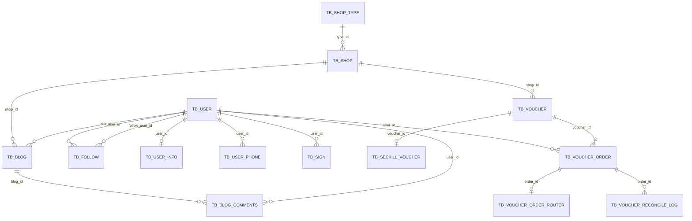
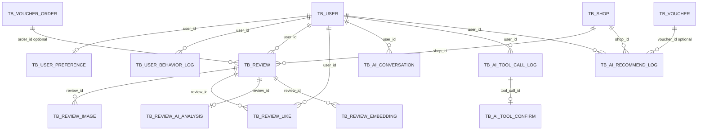

# Spot AI 表关系说明

## 1. 项目与数据库定位

`doc/Spot_AI_技术文档.md` 描述的是一个基于黑马点评业务扩展的本地生活点评系统。项目目标不是只做商户查询，而是在用户、商户、探店 Feed、优惠券秒杀、订单等核心业务上，继续扩展微服务、搜索、消息队列、用户画像、AI Agent 和 RAG 评论总结能力。

当前 `sql` 目录中的表结构主要覆盖第一阶段的业务底座：

- 用户登录、用户资料、用户手机号拆分存储
- 商户、商户分类、附近商户和商户缓存所需基础数据
- 探店笔记、笔记评论、用户关注关系
- 优惠券、秒杀券、券订单、订单路由、库存对账和回滚失败日志
- 用户签到

`sql/create_database.sql` 创建的是 `spotai_0`、`spotai_1`，`sql/spotai_0.sql` 和 `sql/spotai_1.sql` 也应分别使用 `USE spotai_0`、`USE spotai_1`。这样建库脚本和导入脚本保持一致。

## 2. 分库分表结构

当前 SQL 有两个库文件：

| SQL 文件 | 声明使用的库 | 作用 |
|---|---|---|
| `spotai_0.sql` | `spotai_0` | 第 0 个逻辑库分片 |
| `spotai_1.sql` | `spotai_1` | 第 1 个逻辑库分片 |

部分表同时带有 `_0`、`_1` 后缀，表示表分片：

| 逻辑表 | 物理表 | 分片含义 |
|---|---|---|
| 用户主表 | `tb_user_0`、`tb_user_1` | 用户维度分表 |
| 用户资料表 | `tb_user_info_0`、`tb_user_info_1` | 用户资料随用户分表 |
| 用户手机号表 | `tb_user_phone_0`、`tb_user_phone_1` | 手机号索引或脱敏手机号映射分表 |
| 优惠券表 | `tb_voucher_0`、`tb_voucher_1` | 优惠券分表 |
| 秒杀券表 | `tb_seckill_voucher_0`、`tb_seckill_voucher_1` | 秒杀库存分表 |
| 券订单表 | `tb_voucher_order_0`、`tb_voucher_order_1` | 订单分表 |
| 券订单路由表 | `tb_voucher_order_router_0`、`tb_voucher_order_router_1` | 根据订单定位真实订单分片 |
| 券库存对账日志 | `tb_voucher_reconcile_log_0`、`tb_voucher_reconcile_log_1` | 库存扣减和恢复流水分表 |

`tb_blog`、`tb_blog_comments`、`tb_follow`、`tb_shop`、`tb_shop_type`、`tb_sign`、`tb_rollback_failure_log` 在两个库中都存在，但表名没有 `_0/_1` 后缀。它们可能是广播表、按库维度拆分的数据表，或当前阶段尚未完全规范的分库设计。

## 3. 核心关系总览

SQL 中没有显式声明外键，上图关系来自字段命名、索引和业务语义推断。实现层需要通过服务代码保证引用一致性。

## 4. 用户域

| 表 | 关键字段 | 说明 |
|---|---|---|
| `tb_user_0`、`tb_user_1` | `id`、`phone`、`password`、`nick_name`、`icon` | 用户主表，保存登录和基础展示信息。`phone` 有唯一索引。 |
| `tb_user_info_0`、`tb_user_info_1` | `user_id`、`city`、`fans`、`followee`、`gender`、`birthday`、`credits`、`level` | 用户扩展资料，与用户主表按 `user_id` 关联。 |
| `tb_user_phone_0`、`tb_user_phone_1` | `user_id`、`phone` | 手机号到用户的映射或索引表，`phone` 有普通索引。 |
| `tb_follow` | `user_id`、`follow_user_id` | 用户关注关系。 |
| `tb_sign` | `user_id`、`year`、`month`、`date` | 用户签到记录。 |

用户域主要关系：

- `tb_user_info_0/1.user_id` 指向对应用户分表中的 `tb_user_0/1.id`。
- `tb_user_phone_0/1.user_id` 指向对应用户分表中的 `tb_user_0/1.id`。
- `tb_follow.user_id` 表示发起关注的人，`tb_follow.follow_user_id` 表示被关注的人。
- `tb_sign.user_id` 指向用户，用于记录每日签到。

## 5. 商户域

| 表 | 关键字段 | 说明 |
|---|---|---|
| `tb_shop_type` | `id`、`name`、`icon`、`sort` | 商户分类表。 |
| `tb_shop` | `id`、`name`、`type_id`、`area`、`address`、`x`、`y`、`avg_price`、`sold`、`comments`、`score`、`open_hours` | 商户主表，包含分类、地理位置、价格、销量、评分等搜索和推荐核心字段。 |

商户域主要关系：

- `tb_shop.type_id` 指向 `tb_shop_type.id`。
- `tb_shop.x`、`tb_shop.y` 可同步到 Redis GEO 或 Elasticsearch `geo_point`，用于附近商户和距离排序。
- `tb_shop.score`、`sold`、`comments` 是搜索排序、推荐排序和 AI 推荐解释的重要特征。

## 6. 内容与社交域

| 表 | 关键字段 | 说明 |
|---|---|---|
| `tb_blog` | `id`、`shop_id`、`user_id`、`title`、`images`、`content`、`liked`、`comments` | 探店笔记表。 |
| `tb_blog_comments` | `id`、`user_id`、`blog_id`、`parent_id`、`answer_id`、`content`、`liked`、`status` | 探店笔记评论表，支持一级评论和回复。 |
| `tb_follow` | `user_id`、`follow_user_id` | 支撑关注流 Feed。 |

内容域主要关系：

- `tb_blog.user_id` 指向发布笔记的用户。
- `tb_blog.shop_id` 指向被探店的商户。
- `tb_blog_comments.blog_id` 指向被评论的笔记。
- `tb_blog_comments.user_id` 指向评论发布者。
- `tb_blog_comments.parent_id` 指向一级评论；为 `0` 时通常表示一级评论。
- `tb_blog_comments.answer_id` 指向被回复的评论，用于多级回复展示。
- `tb_follow` 与 `tb_blog` 结合，可实现关注用户的探店 Feed。

## 7. 优惠券与订单域

| 表 | 关键字段 | 说明 |
|---|---|---|
| `tb_voucher_0`、`tb_voucher_1` | `id`、`shop_id`、`title`、`pay_value`、`actual_value`、`type`、`status` | 优惠券主表。`type=0` 表示普通券，`type=1` 表示秒杀券。 |
| `tb_seckill_voucher_0`、`tb_seckill_voucher_1` | `voucher_id`、`init_stock`、`stock`、`allowed_levels`、`min_level`、`begin_time`、`end_time` | 秒杀券扩展表，保存库存、参与资格和秒杀时间。 |
| `tb_voucher_order_0`、`tb_voucher_order_1` | `id`、`user_id`、`voucher_id`、`pay_type`、`status`、`reconciliation_status`、`pay_time`、`use_time`、`refund_time` | 用户购买优惠券产生的订单。 |
| `tb_voucher_order_router_0`、`tb_voucher_order_router_1` | `order_id`、`user_id`、`voucher_id` | 订单路由表，用于根据订单号定位用户、券和真实订单分片。 |

优惠券与订单域主要关系：

- `tb_voucher_0/1.shop_id` 指向 `tb_shop.id`，表示券属于哪个商户。
- `tb_seckill_voucher_0/1.voucher_id` 指向 `tb_voucher_0/1.id`，一张秒杀券对应一条秒杀库存记录。
- `tb_voucher_order_0/1.user_id` 指向用户，表示谁下单。
- `tb_voucher_order_0/1.voucher_id` 指向优惠券，表示买了哪张券。
- `tb_voucher_order_router_0/1.order_id` 指向券订单，用于分库分表后的订单定位。

秒杀主链路可以理解为：

1. 用户请求抢券。
2. Redis Lua 校验库存、时间、会员等级和一人一单。
3. Redis 预扣库存成功后异步创建 `tb_voucher_order_0/1`。
4. 创建订单成功后记录路由和对账日志。
5. 如果订单创建失败或超时，需要回滚 Redis 和 MySQL 库存。

## 8. 对账与补偿域

| 表 | 关键字段 | 说明 |
|---|---|---|
| `tb_voucher_reconcile_log_0`、`tb_voucher_reconcile_log_1` | `order_id`、`user_id`、`voucher_id`、`message_id`、`before_qty`、`change_qty`、`after_qty`、`trace_id`、`log_type`、`business_type`、`reconciliation_status` | 优惠券库存变更流水和对账日志。 |
| `tb_rollback_failure_log` | `voucher_id`、`user_id`、`order_id`、`trace_id`、`detail`、`result_code`、`retry_attempts`、`source` | Redis 或库存回滚失败时的补偿记录。 |

对账与补偿关系：

- `tb_voucher_reconcile_log_0/1.order_id` 指向券订单。
- `tb_voucher_reconcile_log_0/1.voucher_id` 指向优惠券。
- `tb_voucher_reconcile_log_0/1.trace_id` 用于串联一次库存扣减、恢复或补偿链路。
- `tb_rollback_failure_log` 记录回滚失败场景，便于定时任务或人工补偿。

这部分表是秒杀高并发链路的兜底能力。业务上 Redis 负责快速校验和预扣，MySQL 表负责最终订单、库存流水和异常可追溯。

## 9. AI 功能新增的数据表

当前 SQL 已经能支撑用户、商户、Feed、优惠券秒杀和券订单等基础业务。为了进一步支撑技术文档中的 AI Agent、评论 RAG、个性化推荐和高风险工具确认，已在 `sql/spotai_0.sql` 和 `sql/spotai_1.sql` 中新增 AI 与画像相关表。

| 新增表 | 状态 | 关联主表 | 用途 |
|---|---|---|---|
| `tb_user_preference_0`、`tb_user_preference_1` | 已创建 | `tb_user_0/1.id` | 保存用户偏好的分类、预算、区域、场景和避坑关键词，用于个性化找店和优惠券推荐。 |
| `tb_user_behavior_log_0`、`tb_user_behavior_log_1` | 已创建 | `tb_user_0/1.id`、业务目标表 | 记录浏览商户、收藏、搜索、下单、点击 AI 推荐等行为，用于生成用户画像。 |
| `tb_review` | 已创建 | `tb_user_0/1.id`、`tb_shop.id`、可选 `tb_voucher_order_0/1.id` | 独立商户点评表。当前 `tb_blog` 更像探店笔记，`tb_blog_comments` 是笔记评论，不适合直接承担商户评价和 RAG 知识源。 |
| `tb_review_image` | 已创建 | `tb_review.id` | 保存点评图片，避免把多图长期塞进一个字符串字段。 |
| `tb_review_like` | 已创建 | `tb_review.id`、`tb_user_0/1.id` | 保存点评点赞关系，Redis 可做实时去重和计数，MySQL 做最终落库。 |
| `tb_review_ai_analysis` | 已创建 | `tb_review.id`、`tb_shop.id` | 保存情绪、场景标签、优缺点摘要、是否适合约会/亲子/聚餐等 AI 分析结果。 |
| `tb_review_embedding` | 已创建 | `tb_review.id`、`tb_shop.id` | 保存评论分片、向量引用和 embedding 元数据，用于 RAG 检索。向量本体可放 pgvector、Milvus 或 ES Vector。 |
| `tb_ai_conversation_0`、`tb_ai_conversation_1` | 已创建 | `tb_user_0/1.id` | 保存 AI 会话消息，支撑多轮对话和上下文恢复。 |
| `tb_ai_tool_call_log_0`、`tb_ai_tool_call_log_1` | 已创建 | `tb_user_0/1.id`、业务目标表 | 记录工具名、风险等级、输入输出、状态、确认令牌等，支撑审计、风控和问题追踪。 |
| `tb_ai_tool_confirm_0`、`tb_ai_tool_confirm_1` | 已创建 | `tb_user_0/1.id`、`tb_ai_tool_call_log_0/1.id` | 保存高风险工具的二次确认状态，例如 AI 秒杀下单、取消订单、领取优惠券。 |
| `tb_ai_recommend_log_0`、`tb_ai_recommend_log_1` | 已创建 | `tb_user_0/1.id`、`tb_shop.id`、`tb_voucher_0/1.id` | 记录 AI 推荐了哪些商户或券、推荐分、推荐理由和用户是否点击，用于评估推荐效果。 |

这些表没有混入现有业务表中。AI 相关数据有明显的审计、检索、异步处理和快速增长特征，独立建表能降低对核心交易表的影响，也方便后续拆分到 `ai-agent`、`review`、`user-profile` 等服务。

## 10. 建议新增表关系

推荐的 AI 表设计方向：

- `tb_user_preference_0/1` 跟随用户分表，按 `user_id` 路由，查询画像时成本最低。
- `tb_user_behavior_log_0/1` 数据量会很大，建议按 `user_id` 分表，并保留 `target_type`、`target_id` 支持商户、券、订单、评论、AI 推荐等多种目标。
- `tb_review` 如果后续评论量很大，可以先单表起步，之后按 `shop_id` 或 `user_id` 分片。RAG 按商户检索更常见，因此 `shop_id` 必须建索引。
- `tb_review_embedding` 可以只存 `embedding_id`、`vector_store`、`chunk_text`、`chunk_index` 等元数据，真实向量交给 pgvector、Milvus 或 Elasticsearch Vector。
- `tb_ai_tool_call_log_0/1` 和 `tb_ai_tool_confirm_0/1` 是 AI 安全工具调用的核心表。高风险动作不应只依赖前端确认，后端也要校验确认记录、用户身份、工具名、过期时间和业务目标。
- `tb_ai_recommend_log_0/1` 用于闭环推荐效果，把“AI 推荐了什么”和“用户有没有点击/领取/下单”连接起来，后续可以反哺 `tb_user_preference_0/1`。

## 11. 当前 SQL 与技术文档的差距

第 9 节中的 AI 与推荐相关表已经补充到 SQL 中。现有数据库已经从单纯业务基础库扩展为 Spot AI 的第一版完整业务库：既具备商户、用户、Feed、优惠券秒杀和订单能力，也具备 AI Agent 会话、工具调用审计、二次确认、评论 RAG 元数据、用户画像和推荐闭环所需的核心表。

## 12. 建议的阅读顺序

理解表关系时建议按下面顺序读：

1. 先看 `tb_shop_type` 和 `tb_shop`，理解商户分类和商户详情。
2. 再看 `tb_user_0/1`、`tb_user_info_0/1`、`tb_user_phone_0/1`，理解用户拆分。
3. 然后看 `tb_blog`、`tb_blog_comments`、`tb_follow`，理解探店内容和关注 Feed。
4. 最后看 `tb_voucher_0/1`、`tb_seckill_voucher_0/1`、`tb_voucher_order_0/1`、`tb_voucher_reconcile_log_0/1`、`tb_rollback_failure_log`，理解秒杀券、异步下单、对账补偿链路。

整体上，`tb_user`、`tb_shop`、`tb_voucher`、`tb_voucher_order` 是主干实体；`tb_blog` 连接用户和商户形成内容；`tb_follow` 支撑社交关系；`tb_seckill_voucher`、`tb_voucher_reconcile_log`、`tb_rollback_failure_log` 则围绕高并发秒杀做库存和异常一致性保障。
